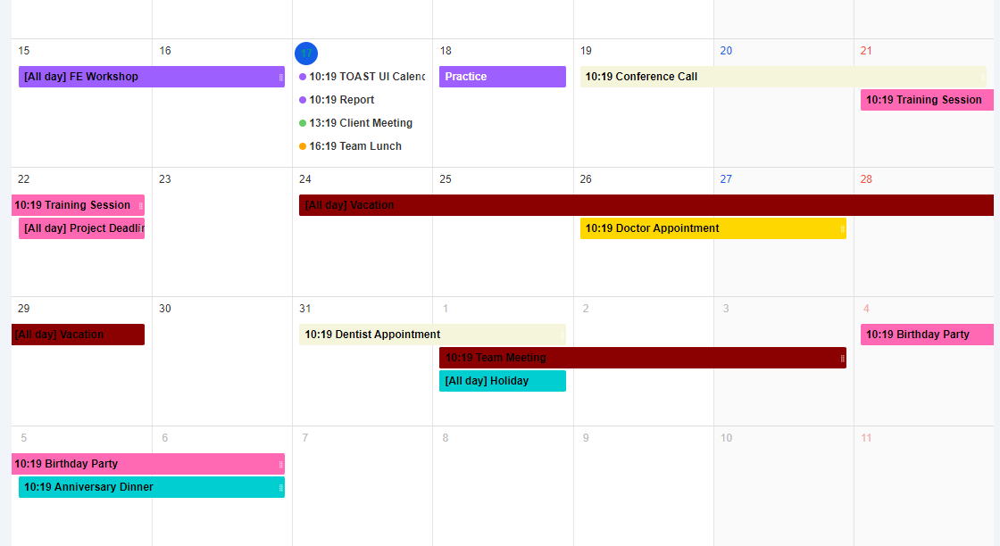

# Appointment Scheduler

<p align="center">
  <a href="https://github.com/Blue-Pheasant/Odoo-connector">
    
    <h2 align="center">Appointment scheduler</h2>
  </a>
</p> 
<p align="center">The Appointment Scheduler is a web application that provides a platform for users to easily manage their meeting appointments. With features like scheduling, cancelling, and sending invitations, users can efficiently organize their appointments and stay on top of their schedule.</p>


## Technology
The Appointment Scheduler is built using the ReactJS front-end framework and the ASP.NET Core back-end framework. This combination of technologies provides a robust and scalable solution that can handle a large number of users and appointments.

## React UI Component
The Appointment Scheduler utilizes the Tui Calendar UI component, which provides an intuitive and user-friendly interface for managing appointments. With Tui Calendar, users can easily view their appointments in a calendar format, drag and drop appointments to different time slots, and interact with appointments to view details or make changes.

## Getting Started
To get started with the Appointment Scheduler, simply clone the repository and follow the installation instructions in the README file. Once installed, you can run the application and start managing your appointments right away.

### Step 1: Clone The Repo

```bash
git clone https://github.com/Blue-Pheasant/scheduler
```

### Step 2: Install Dependencies
1. Install packages for .NET

```bash
dotnet restore
```

2. Install packages for Client app

Access into the project directory

```bash
cd ClientApp
```

Install all the dependencies in `package.json`

```bash
npm install
```

## :open_file_folder: Project structure

A quick look at the folder structure of this project.

    │   README.md
    │
    ├─── ClientApp
    │       Public      
    │       Src
    |        └─── components
    │        └─── layouts  
    |        └─── pages
    |        └─── services
    │       package.json  
    │
    ├─── Controllers
    │   │   UserController.cs       
    │   │   AuthController
    │
    ├─── Data
    │   │   Configurations       
    │   │   Entities
    │   │   Migrations       
    │   │   DBContext.cs
    |
    ├─── Docs
    │
    ├─── Middlewares
    │   │   JwtMiddleware.cs
    │   │   LoggingMiddleware.cs
    │
    ├─── Model
    │   └─── Request
    │   └─── Response
    |
    └─── Services
        ├─── Interfaces
        └─── AuthService.cs
        └─── HashService.cs
        └─── UserService.cs
        └─── TokenService.cs


## Contributing
If you would like to contribute to the development of the Appointment Scheduler, please follow the guidelines in the CONTRIBUTING file. We welcome all contributions and appreciate your support in making the application even better.

## License
The Appointment Scheduler is licensed under the MIT License. See the LICENSE file for more details.
